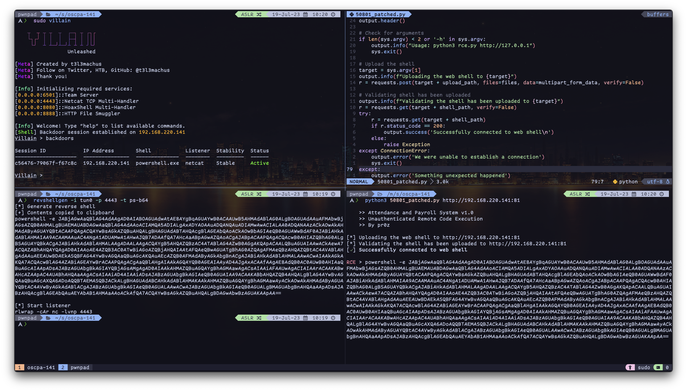

<div align="center">
    
    <br/>
    <br/>
    <a href="https://github.com/pwnpad/pwnpad/blob/master/LICENSE"></a>
    <a href="https://hub.docker.com/_/docker"></a>
    
    <a href="https://github.com/pwnpad/pwnpad/actions"></a>
    <br/>
    <a href="https://hub.docker.com/r/platypew/pwnpad/tags"></a>
    <a href="https://hub.docker.com/r/platypew/pwnpad/tags"></a>
    <br/>
    <a href="https://hub.docker.com/r/platypew/pwnpad/tags"></a>
    <a href="https://hub.docker.com/r/platypew/pwnpad/tags"></a>
    <br/>
    <h1>PwnPad</h1>
    <p>Perfect for doing Capture-The-Flag challenges and Pentesting on any platform, without needing a clunky, fat, resource hungry virtual machine. PwnPad provides a wide array of tools at your very own fingertips, powered by Arch Linux!</p>
    <br/>
    
    <i>Got OSCP with this btw 👍🏼</i>
</div>

## Contents

1. [Download](#download)
2. [Usage](#usage)
3. [Features](#features)
4. [Tools](#tools)
5. [License](#license)

<div align="center">
    <h1>Download</h1>
    <p>How to Download and Install PwnPad</p>
</div>

#### Requirements

-   Docker installed (Docker Desktop for Windows & Mac)
-   Nerd Fonts installed

PwnPad can be downloaded using the git command

```
git clone https://github.com/pwnpad/pwnpad.git
```

```bash
# Build image locally
p2 build            # Base image
p2 build -i extra   # Extra image

# Or pull from Docker Hub
docker pull platypew/pwnpad:latest # Base image
docker pull platypew/pwnpad:extra  # Extra tools
```

You can get basic autocompletion by sourcing the `_p2-autocomplete.zsh` file in your zshrc or source it

```bash
source _p2-autocomplete.zsh
```

<br/>
<div align="center">
    <h1>Usage</h1>
    <p>How to operate PwnPad</p>
</div>

### General

You might want to alias `p2` in your bashrc/zshrc

```
$ p2
USAGE:
  p2 <SUBCOMMAND>

SUBCOMMAND:
  build     Build Docker image
  attach    Attach into container
  rm        Remove container and its volumes
  kill      Stop container from running
  volume    Enter into container's volume
  ls        List pwnpad instances
  update    Update image to the latest build

HELP:
  p2 build -h
  p2 attach -h
  p2 rm -h
```

<br/>
<div align="center">
    <h1>Features</h1>
    <p>Why PwnPad over other Docker-based environments?</p>
</div>
<br/>

1. It's powered by Arch (which means you have the power of the AUR)
2. It runs on MacOS and Linux (Windows using WSL2)
3. It runs Systemd as its init process (controversial, but here you go anyways)
4. It's built for both amd64 and arm64
5. It's super lightweight taking a little over 3GB of space (7.5GB for the extra image)
6. You can spawn as many instances as you want and remove them just as quick (does not pollute your system)
7. Supports X11 forwarding, which means you don't need the whole desktop environment just to run GUI programs when you can just forward it your host
8. Supports VNC and noVNC with i3, which means you have a super lightweight window manager
9. Customised Neovim and Zsh so you look _super_ cool using it

### Integrated Features

#### SSH

You can ssh into PwnPad by doing these steps.

1. `sudo systemctl start sshd`
2. Insert your public key into `~/.ssh/authorized_keys`
3. Use `p2 ls` to the port bound to port 22
4. Do `ssh -p <port> pwnpad@localhost`

#### Proxy

You can proxy your traffic through PwnPad by doing these steps.

. Use `p2 ls` to the port bound to port 22 2. `sshuttle -vHNr pwnpad@localhost:<port>`

#### Publish Port to Public

You can use ngrok to publish a port to the public.

-   Start: `publish start` (Insert api key if prompted)
-   Stop: `publish stop`
-   Status: `publish status`
-   Set a port to tunnel: `publish set <port>`
-   Delete a tunnelling port: `publish del <port>`

#### Toggle ASLR

You can turn ASLR on and off.

-   On: `aslr on`
-   Off: `aslr off`

#### Enable noVNC (only in extra image)

Enabling VNC (you may need to run your system through a proxy to access the noVNC server).

-   Start: `gui start`
-   Stop: `gui stop`

#### Create intel environment (only in arm64 image)

Creates a chroot environment to run purely intel binaries.
You can still run intel binaries that uses only glibc within the regular context.

-   Use pacman: `intel-pacman`
-   Run command: `intel-run`

### Included Infosec Tools

| Tools         | Description                                                                                      |
| ------------- | ------------------------------------------------------------------------------------------------ |
| aflplusplus   | American Fuzzing Lop fuzzer with community patches and additional features                       |
| binwalk       | Tool for searching a given binary image for embedded files                                       |
| exiftool      | Meta information reader/writer                                                                   |
| exploitdb     | The official Exploit Database repository                                                         |
| foremost      | A console program to recover files based on their headers, footers, and internal data structures |
| gdb-multiarch | The GNU Debugger for all gdb supported architectures (i386/arm/mips...)                          |
| gobuster      | URI and DNS subdomain bruteforcer                                                                |
| hexedit       | Terminal-based hex editor                                                                        |
| jadx          | Java decompiler                                                                                  |
| metasploit    | Platform for developing, testing, and executing exploits                                         |
| netcat        | Network piping application                                                                       |
| ngrok         | Secure introspectable tunnels to localhost webhook development tool and debugging tool           |
| nmap          | Utility for network discovery and security auditing                                              |
| pwndbg        | Makes debugging with GDB suck less                                                               |
| pwntools      | Useful CTF utilities.                                                                            |
| rizin         | Open-source tools to disasm, debug, analyze and manipulate binary files (With Ghidra Decompiler) |
| ropper        | Gadget finder.                                                                                   |
| rsactftool    | RSA attack tool (mainly for CTFs)                                                                |
| sqlmap        | Automatic SQL injection and database takeover tool                                               |
| xortool       | XOR analysis tool.                                                                               |
| yafu          | Yafu factor input integers in a completely automated way.                                        |
| z3            | Theorem prover from Microsoft Research.                                                          |

### Extra Tools

<details>
    <summary>Can only be found in platypew/pwnpad:extra</summary>

| Tools              | Description                                                                                     |
| ------------------ | ----------------------------------------------------------------------------------------------- |
| arp-scan           | A tool that uses ARP to discover and fingerprint IP hosts on the local network                  |
| autorecon          | A multi-threaded network reconnaissance tool which performs automated enumeration of services   |
| commix             | Automated All-in-One OS Command Injection and Exploitation Tool                                 |
| crackmapexec       | A swiss army knife for pentesting Windows/Active Directory environments                         |
| creddump           | A python tool to extract various credentials and secrets from Windows registry hives            |
| crunch             | A wordlist generator for all combinations/permutations of a given character set                 |
| dnsenum            | Script that enumerates DNS information from a domain                                            |
| dnsrecon           | Python script for enumeration of hosts, subdomains and emails from a given domain using google. |
| enum4linux-ng      | A tool for enumerating information from Windows and Samba systems                               |
| expect             | A tool for automating interactive applications                                                  |
| fping              | Utility to ping multiple hosts at once                                                          |
| hashcat            | Multithreaded advanced password recovery utility                                                |
| hping              | A command-line oriented TCP/IP packet assembler/analyzer                                        |
| impacket           | Collection of classes for working with network protocols                                        |
| iodine             | Tunnel IPv4 data through a DNS server                                                           |
| john               | John the Ripper password cracker                                                                |
| lbd                | Load Balancing detector                                                                         |
| ligolo-ng          | An advanced, yet simple, tunneling tool that uses a TUN interface                               |
| ldapenum           | Enumerate domain controllers using LDAP                                                         |
| nbtscan            | Scan networks searching for NetBIOS information                                                 |
| ncrack             | High-speed network authentication cracking tool                                                 |
| nikto              | A web server scanner which performs comprehensive tests against web servers                     |
| onesixtyone        | An SNMP scanner that sends multiple SNMP requests to multiple IP addresses                      |
| revshellgen        | Simple script to generate commands to achieve reverse shells                                    |
| rustscan           | A modern port scanner                                                                           |
| scalpel            | A frugal, high performance file carver                                                          |
| sleuthkit          | File system and media management forensic analysis tools                                        |
| smbmap             | A handy SMB enumeration tool                                                                    |
| snmpcheck          | A free open source utility to get information via SNMP protocols                                |
| swaks              | Swiss Army Knife SMTP; Command line SMTP testing, including TLS and AUTH                        |
| wafw00f            | Identify and fingerprint Web Application Firewall (WAF) products protecting a website           |
| wce                | A security tool to list logon sessions and add, change, list and delete associated credentials  |
| whatweb            | Next generation web scanner that identifies what websites are running                           |
| whois              | Intelligent WHOIS client                                                                        |
| windows-binaries   | A collection of pentesting Windows binaries                                                     |

</details>

### Included QoL Tools

| Software     | Description                                                                        |
| ------------ | ---------------------------------------------------------------------------------- |
| autojump     | A cd command that learns                                                           |
| bat          | Cat clone with syntax highlighting and git integration                             |
| exa          | ls replacement                                                                     |
| fzf          | A fuzzy finder                                                                     |
| neovim       | A fully-fledged personal development environment                                   |
| openvpn      | An easy-to-use, robust and highly configurable VPN                                 |
| powerlevel0k | Beautiful zsh shell using powerlevel10k theme                                      |
| qemu-user    | Allows emulation of i386 and x86_64 binaries (Only for arm64 builds)               |
| ripgrep      | Grep but fasstttt                                                                  |
| tmux         | Allows multiple terminal sessions to be accessed simultaneously in a single window |
| zsh          | A modern shell with a bunch a plugins powered by zgenom                            |

<div align="center">
    <h3>And many more!</h1>
</div>
<br/>

<div align="center">
    <h1>License</h1>
    <p>This project is released under the <a href="https://github.com/pwnpad/pwnpad/blob/master/LICENSE">MIT License</a></p>
</div>
